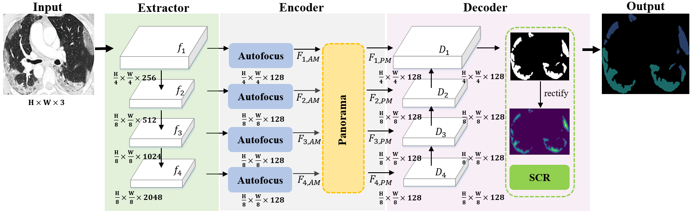

# Focus-Fusion-and-Rectify-Context-Aware-Learning-for-COVID-19-Lung-Infection-Segmentation

## Introduction

The coronavirus disease 2019 (COVID-19) pandemic is spreading worldwide. Considering the limited clinicians and resources, and the evidence that computed tomography (CT) analysis can achieve comparable sensitivity, specificity and accuracy with reverse-transcription polymerase chain reaction, the automatic segmentation of lung infection from CT scans supplies a rapid and effective strategy for COVID-19 diagnosis, treatment and follow-up. It is challenging because the infection appearance has high intra-class variation and inter-class indistinction in CT slices. Therefore, a new context-aware neural network is proposed for lung infection segmentation. Specifically, the Autofocus and Panorama modules are designed for extracting fine details and semantic knowledge and capturing the long-range dependencies of the context from both peer-level and cross-level. Also, a novel structure consistency rectification is proposed for calibration by depicting the structural relationship between foreground and background.

## Update

2021/8: the code released.

##
